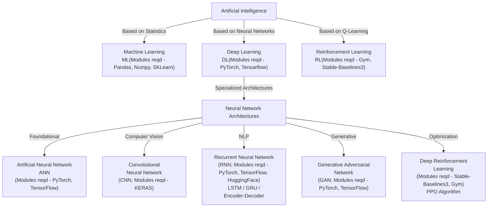

# Artificial Intelligence Classification

## Overview

Artificial Intelligence is classified into three main categories based on different approaches and technologies.

## Visual Classification Diagram

---

***DE - Data Engineering*** :: This is very important part of every industry project which is connected to AI.

---

## Machine Learning

Machine Learning (ML) is deeply rooted in statistics, but to actually do Machine Learning, you must spend a ton of time on the Data Science (DS) side doing EDA, Feature Engineering, and data analysis first. 
The reality of ML: **80% Data, 20% Modeling**.

### Key Components

#### 1. Exploratory Data Analysis (EDA)
- Understand data distributions, correlations, missing values, and outliers

#### 2. Feature Engineering
- Transform raw data into meaningful signals for the algorithm
- Handle missing values, normalize data, create new features

#### 3. Statistics
- Foundation for data preparation, modeling, and evaluation
- Ensures representative samples and validates model performance

---

## Neural Network Architectures (Deep Learning) - Detailed Overview

### Artificial Neural Network (ANN)
#### Notes
- Multilayer Perceptron. The foundational architecture of modern deep learning and represents the classic, vanilla form of an Artificial Neural Network

### Convolutional Neural Network (CNN)
#### Notes
- Computer Vision
- Image processing and visual recognition tasks

### Recurrent Neural Network (RNN)
#### Notes
- Natural Language Processing (NLP)
- LSTM (Long Short-Term Memory) or GRU (Gated Recurrent Unit)
- Encoder-Decoder architectures
- These are advanced algorithms based on Transformer Architectures, which was a breakthrough for NLP. From here we start for ***Generative AI***
- All the LLMs/SLMs/MMLLMs are created on top of this.
    - After this we will **Fine-tune** the LLMs
    - We will create RAGs/MMRAGs
    - How to create the Agents
    - LLMOps

### Generative Adversarial Network (GAN)
#### Notes
- Adversarial learning approach for generative tasks

### Deep Reinforcement Learning
#### Notes
- PPO (Proximal Policy Optimization)
- Combines deep learning with reinforcement learning principles

---

## Foundation for Generative AI

We will start from Transformers. The following packages and frameworks are essential to learn:

### Core ML & Deep Learning
1. **PyTorch** - Basic understanding required

### NLP & Model Frameworks
2. **HuggingFace** - Pre-trained models and transformers library
3. **Unsloth** - Efficient fine-tuning of language models
4. **Langchain** - Framework for building applications with language models
5. **LlamaIndex** - Data framework for LLM applications
6. **LangGraph** - Building stateful, multi-actor applications

### Infrastructure & Data
7. **Data Parsing Frameworks** - Tools for handling different data formats
8. **Vector Databases** - Storage and retrieval of embeddings
9. **Cloud Platforms** - Deployment and scaling infrastructure

### APIs & Safety
10. **OpenAI SDK** - Integration with OpenAI APIs
11. **GuardRails** - Safety and compliance frameworks
12. **MCP** - Model Context Protocol 